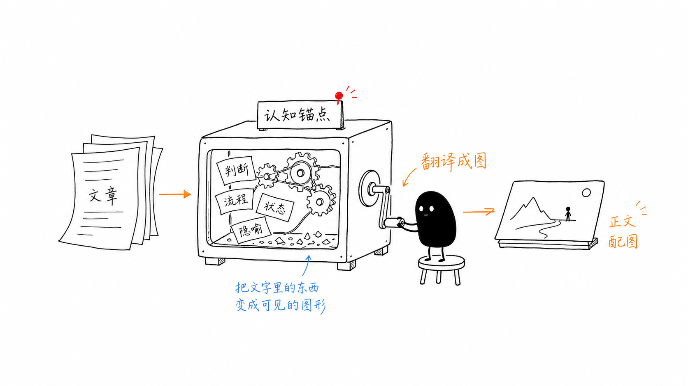
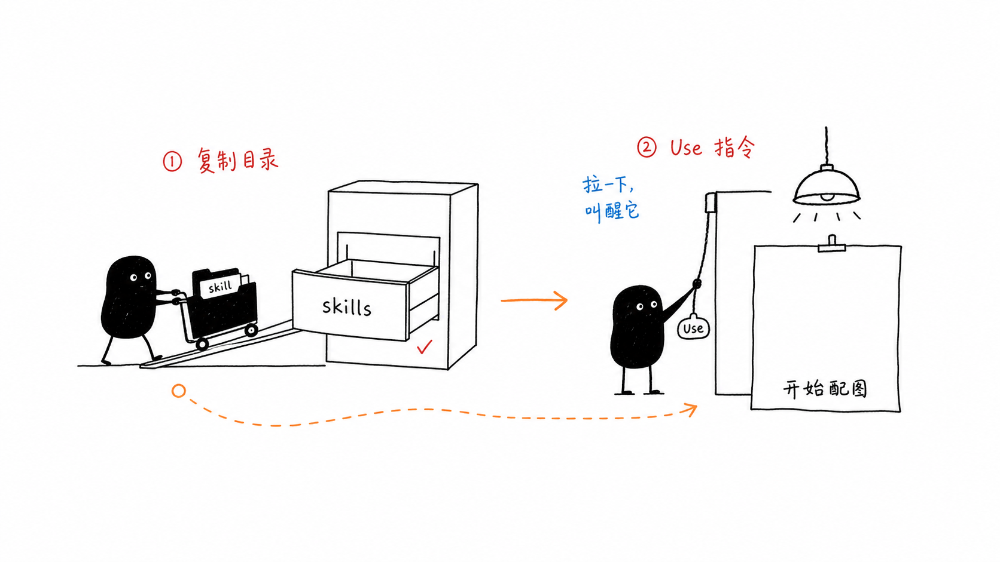
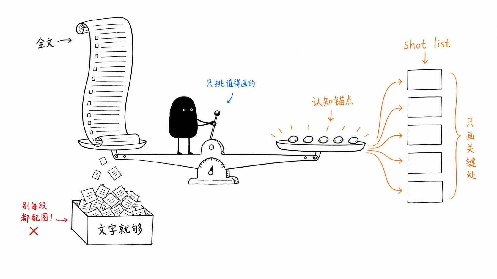
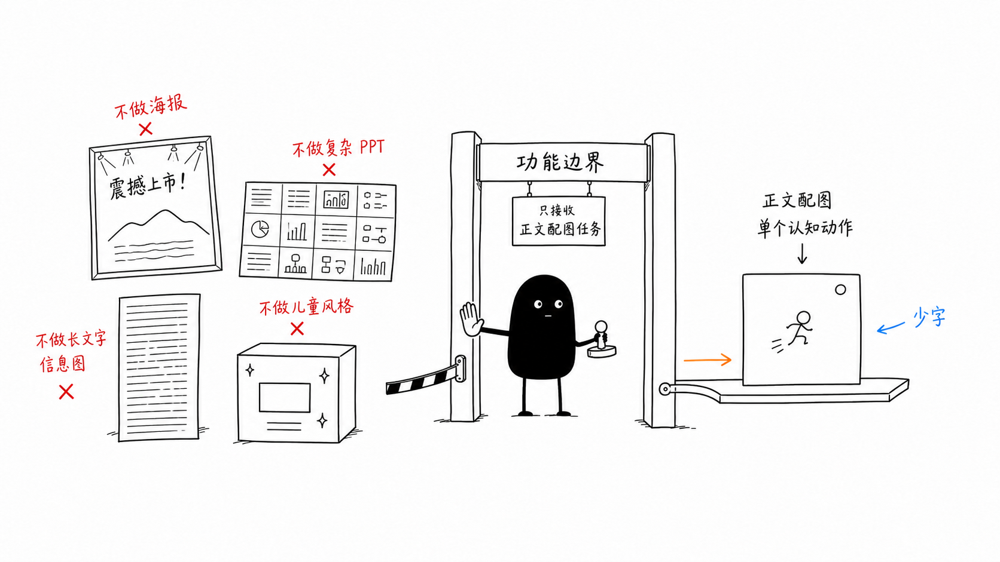

# 第一次使用 Ian Xiaohei Illustrations：把中文文章画成小黑怪诞正文配图

如果你第一次接触 `ian-xiaohei-illustrations`，先把它理解成一个 Codex Skill，而不是一包现成图片，也不是一个通用插画 prompt。

它真正做的事是：读懂一篇中文文章里的关键判断、流程、结构、状态或隐喻，然后把其中一个“认知动作”画成一张 16:9 横版正文配图。默认风格是纯白背景、黑色手绘线稿、少量红橙蓝中文批注，以及一个认真干活的小黑角色。



## 这个项目适合解决什么问题

它最适合用在知识型中文内容里，例如文章、博客、公众号、帖子、Notion 文档、工作流说明、方法论拆解、AI 使用教程、产品思考和个人经验总结。

你可以让它做三类事情：

1. 只规划配图：让它先分析文章，输出 4-8 张 shot list，不生成图片。
2. 直接生成配图：给它文章或主题，让它为正文生成多张 PNG。
3. 单张概念图：只给一个观点，让它画成一张正文插图。

它的重点不是“画得漂亮”，而是“把抽象内容变成一个读者一眼能抓住的视觉隐喻”。比如把“内容筛选”画成小黑操作一台怪秤，把“功能边界”画成小黑守门，把“工作流”画成一条被检查车拖着走的路线。

## 安装和触发方式

安装时真正要复制的是仓库里的 skill 子目录：

```bash
mkdir -p "${CODEX_HOME:-$HOME/.codex}/skills"
cp -R ./ian-xiaohei-illustrations "${CODEX_HOME:-$HOME/.codex}/skills/"
```

安装后，在 Codex 里用下面这种方式触发：

```text
Use $ian-xiaohei-illustrations 为这篇中文文章设计并生成 5 张小黑怪诞正文配图。
```

关键是 `Use $ian-xiaohei-illustrations`。这句话会让 Codex 读取这个 skill 的规则：先理解正文，再选择认知锚点，再按小黑怪诞手绘风格生成图。



## 它有哪些核心功能

第一，分析文章。它会先判断文章的核心观点是什么，哪些段落承担认知转折，哪些地方适合画图，哪些地方文字本身就够了。

第二，输出 shot list。shot list 是配图清单，不是最终图片。每一张会说明放在哪个段落后、主题是什么、核心意思是什么、结构类型是什么、小黑在做什么、建议元素和中文标注词是什么。

第三，生成正文配图。如果你明确说“生成”“输出”“做图”，它会为每张图单独调用图像生成，不会把多张图拼在一张里。

第四，检查和迭代。生成后要看白底、留白、小黑是否承担核心动作、中文是否短而可读、画面是否太像 PPT 或课程页。如果不合格，就重生成或局部编辑。



## 什么时候只要规划，什么时候直接生图

如果你的文章还没定稿，或者你不确定哪里值得配图，先让它只输出 shot list：

```text
Use $ian-xiaohei-illustrations 先不要生图。
请分析下面这篇文章哪里值得配图，输出 5 张左右的 shot list。

<粘贴文章>
```

如果文章已经定稿，并且你确定要图片，就直接说生成：

```text
Use $ian-xiaohei-illustrations 把下面这篇文章生成 5 张小黑怪诞正文配图。
要求：16:9 横版、纯白背景、黑色手绘线稿、少量红橙蓝中文手写批注。

<粘贴文章>
```

如果你只有一个观点，也可以只生成一张：

```text
Use $ian-xiaohei-illustrations 为这个观点生成一张正文配图：

信任不是喊出来的，而是一块证据一块证据铺过去。
```

## 功能边界在哪里

这个 skill 的边界很重要。它适合做“正文解释图”，不适合做万能视觉设计。

适合它的任务包括：中文文章配图、方法论插图、工作流解释、状态隐喻、观点图、帖子正文图、Notion 文档插图。

不适合它的任务包括：商业海报、品牌主视觉、PPT 架构图、复杂流程图、儿童卡通、可爱表情包、长文字信息图、真实 App 截图、严格可编辑的 SVG 或矢量源文件。

一个简单判断标准是：如果你的目标是让读者更快理解文章里的一个关键动作，它适合；如果你的目标是做一张完整设计稿、营销 KV 或复杂系统图，它不适合。



## 正常使用的一套流程

一次完整使用可以按这个顺序走：

1. 准备输入：粘贴文章、Markdown、Notion 内容、截图文字，或者只给一个观点。
2. 说明目标：只要 shot list，还是直接生成图片。
3. 控制数量：短文 1-3 张，中等文章 4-8 张，长文也不要轻易超过 9 张。
4. 控制风格：16:9 横版、纯白背景、黑色手绘线稿、少量红橙蓝手写批注。
5. 检查结果：小黑必须是核心动作主体，不能只是站在旁边。
6. 保存交付：项目内默认放到 `assets/<article-slug>-illustrations/`，按 `01-topic-name.png` 这样的顺序命名。


## 提示词怎么写更稳

最稳的输入不是“帮我配几张好看的图”，而是把上下文和限制说清楚：

```text
Use $ian-xiaohei-illustrations 为下面这篇中文文章生成 5 张正文配图。

要求：
- 每张图只讲一个核心结构
- 不要 PPT 信息图
- 不要商业插画
- 不要可爱卡通
- 小黑必须承担核心动作
- 中文标注尽量短

<粘贴文章>
```

如果你想先审稿，就加一句“先不要生图”。如果你想减少图中文字错误，就要求“中文标注最多 4 个，每个 2-6 个字”。如果你想让图更有记忆点，就要求“重新发明一个低科技、怪诞但成立的物理隐喻”。

## 你应该期待什么结果

好的结果不是一张很满的信息图，而是一张白纸上的怪诞产品草图：小黑认真做一件有点荒诞但能解释问题的事，读者先觉得有点怪，然后很快看懂结构。

最稳定的使用场景是：你已经有一篇中文知识内容，并且希望读者在关键段落停一下，用一张图理解“这里到底发生了什么”。这就是 `ian-xiaohei-illustrations` 最擅长的位置。
